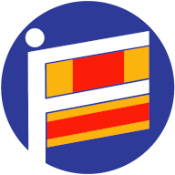

# Flag Flashcards



A fun and interactive web application to help you learn and memorize country flags from around the world. Test your knowledge in quiz mode or browse through the flag deck at your own pace. Customize tags, filter by regions, colors, or track your learning progress with "Correctly Answered" flags!

## ✨ Features

* **Extensive Flag Deck:** Browse through a comprehensive collection of country flags from the REST Countries API.
* **Interactive Flashcards:** Click any flag card to flip it and reveal the country's name and associated tags.
* **Quiz Mode:** Test your knowledge! Guess the country name based on its flag and get instant feedback.
* **Progress Tracking:** Flags you answer correctly in Quiz Mode are marked with a green checkmark on the card's front face. This progress is saved locally in your browser.
* **Customizable Tags:**
    * Each flag comes with predefined tags (e.g., region, subregion, flag colors, patterns like "stripes" or "cross").
    * Edit tags for any flag directly from its card's back face. Your custom tags are saved locally.
* **Dynamic Filtering:**
    * Filter the deck or quiz questions by selecting multiple tags (e.g., "Europe", "red", "star").
    * Special filter options: "Correctly Answered" and "Not Yet Answered" flags, allowing you to focus on what you need to learn.
* **Dark Mode / Light Mode:** Toggle between themes for comfortable viewing in any environment. Your preferred theme is saved locally.
* **Responsive Design:** Enjoy a seamless experience on various devices, from desktops to mobile phones.

## 🚀 Getting Started

Follow these instructions to get a copy of the project up and running on your local machine for development and testing purposes.

### Prerequisites

You need to have Node.js and npm (Node Package Manager) installed on your system.

* [Node.js (includes npm)](https://nodejs.org/en/download/)

### Installation

1.  **Clone the repository (or set up the files):**
    If you're starting from scratch, create a new React project (e.g., using Vite or Create React App) and then place the provided files into their respective locations.

    For example, with Vite:
    ```bash
    npm create vite@latest flag-flashcards -- --template react
    cd flag-flashcards
    # Delete src/App.css, src/assets/react.svg, etc. if you want a clean slate
    ```
    Then, ensure your project structure matches:
    ```
    flag-flashcards/
    ├── public/
    │   └── favicon.png  # favicon (192x192)
    ├── src/
    │   ├── assets/
    │   │   └── images/
    │   │       └── logo.png       # Your logo image
    │   ├── components/
    │   │   ├── Card.jsx
    │   │   ├── DeckView.jsx
    │   │   ├── Header.jsx
    │   │   ├── Loader.jsx
    │   │   ├── QuizView.jsx
    │   │   └── TagEditModal.jsx
    │   ├── constants.js
    │   └── App.jsx
    ├── index.html
    ├── package.json
    ├── tailwind.config.js
    └── vite.config.js   
    ```

2.  **Install dependencies:**
    Navigate into your project directory and install all required Node.js packages. This project uses Tailwind CSS, which will be installed via `package.json`.

    ```bash
    cd flag-flashcards
    npm install
    ```

3.  **Add Favicon to `public/index.html`:**
    Ensure your `public/index.html` file includes a link to your favicon within the `<head>` section:
    ```html
    <link rel="icon" href="/favicon.ico" type="image/x-icon" />
    ```
    (Adjust `favicon.ico` to `favicon.png` if you're using the PNG format).

### Running the application

* **Development Mode:**
    To run the application in development mode:
    ```bash
    npm run dev
    ```
    This will open the application in your browser, usually at `http://localhost:5173`.

* **Build for Production:**
    To create a production-ready build:
    ```bash
    npm run build
    ```
    This compiles the app into the `dist` directory.

* **Deploy to GitHub Pages:**
    This project is configured for easy deployment to GitHub Pages.
    
    **Important:** You must update the `homepage` field in your `package.json` to reflect your specific GitHub Pages URL (e.g., `https://YOUR_GITHUB_USERNAME.github.io/YOUR_REPO_NAME/`).
    
    Ensure you have the `gh-pages` package installed (`npm install gh-pages --save-dev`).
    Then, simply run:
    ```bash
    npm run deploy
    ```
    This script will automatically run `npm run build` and then push the contents of the `dist` folder to the `gh-pages` branch of your repository. Your site will then be available at the `homepage` URL you configured in `package.json`.